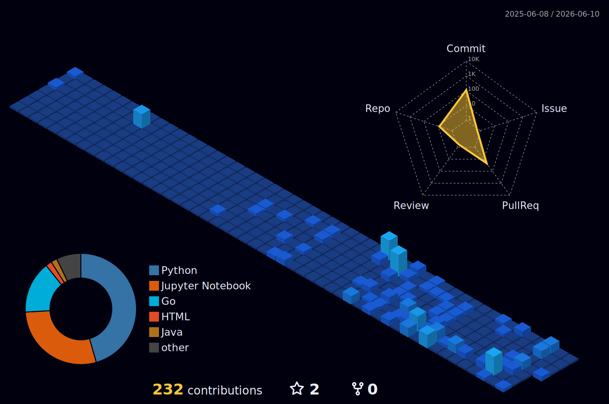

# Elina Dusaeva

<table>
  <tr>
    <td align="center">
      <a href="./%D0%94%D1%83%D1%81%D0%B0%D0%B5%D0%B2%D0%B0%20%D0%AD%D0%BB%D0%B8%D0%BD%D0%B0.pdf">
        <strong>Resume</strong> 
        PDF profile
      </a>
    </td>
    <td align="center">
      <a href="https://t.me/linaroon">
        <strong>Telegram</strong> 
        @linaroon
      </a>
    </td>
    <td align="center">
      <a href="mailto:dusaevaee@mail.ru">
        <strong>Email</strong> 
        dusaevaee@mail.ru
      </a>
    </td>
  </tr>
</table>

## Data Engineering Profile

I build data pipelines and analytical layers around **Airflow**, **PostgreSQL**, **Trino**, **ClickHouse**, **Spark**, and **Iceberg**. I like working close to the data model: from DDL and indexes to orchestration, marts, and query performance.

- Designing ETL pipelines with scheduled DAGs, retries, monitoring, and clear data ownership
- Moving analytical workloads from PostgreSQL to ClickHouse and Trino-based processing
- Building data marts, tables, and views for reporting and downstream analytics
- Optimizing SQL queries with `EXPLAIN`, indexing, join tuning, and schema improvements
- Working with lakehouse patterns: S3-compatible storage, Spark processing, and Apache Iceberg tables

## Selected Background

- MSc student in **Big Data Systems Design and Development** at ITMO University
- BSc in **Computer Technologies in Design** from ITMO University
- Winner of the **Gazprom Snabzhenie 3.0 accelerator**
- English: **C1**

## GitHub Snapshot

  

---

**Open to Data Engineering projects and roles related to ETL, analytics platforms, lakehouse architecture, and scalable data systems.**

[Resume](./%D0%94%D1%83%D1%81%D0%B0%D0%B5%D0%B2%D0%B0%20%D0%AD%D0%BB%D0%B8%D0%BD%D0%B0.pdf) · [Telegram](https://t.me/linaroon) · [Email](mailto:dusaevaee@mail.ru)

